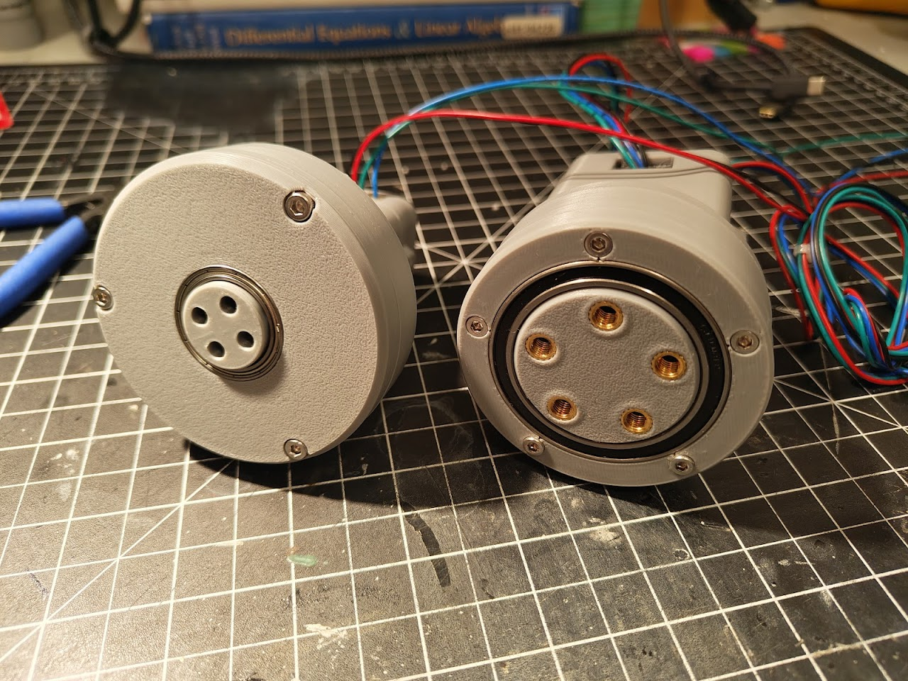
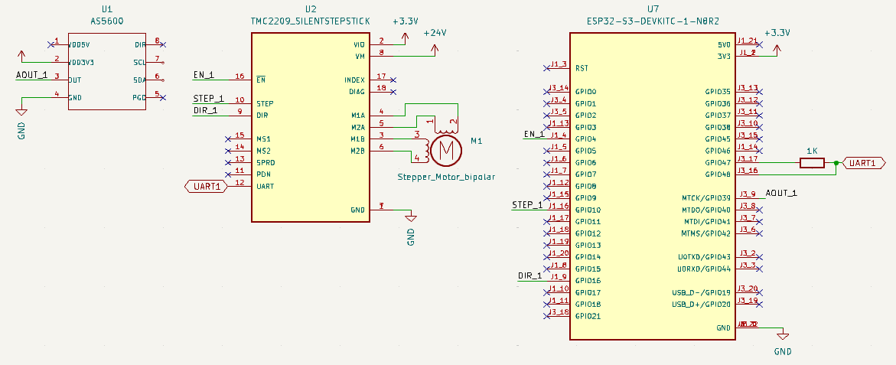
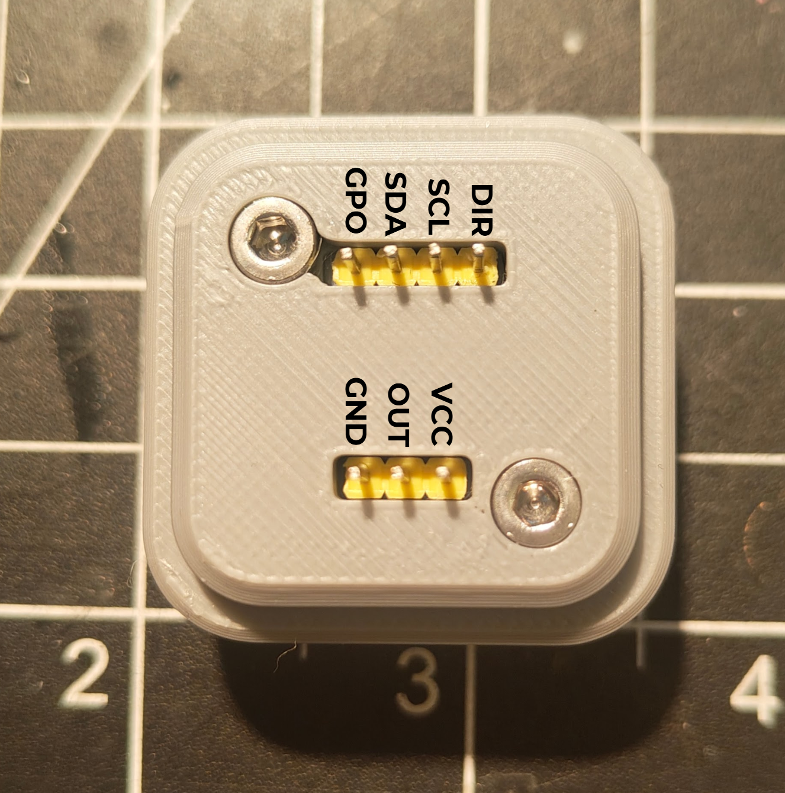

# ATOM-Actuators

This repository contains the source code, hardware files, and documentation for two quasi-direct-drive, closed-loop stepper motor actuators I designed and built as part of a robotic arm project during the 2024 winter break. From concept to completion, both actuators were designed, manufactured, and assembled in four days. Each actuator is 3D printed and features a unique gearbox design, an AS5600 magnetic encoder for precise position feedback, and is powered by a TMC2209 stepper motor driver controlled via an ESP32-S3 microcontroller.

This actuator is open source and free to use for any robotics projects. All the OnShape CAD files are contained [here](https://cad.onshape.com/documents/a7bd79262569e19a42552159/w/6b34bbca82999ac3877c186b/e/5aad9edadc693860d47861f7?configuration=List_WSsS1kYNjhJUWF%3DNEMA17&renderMode=0&uiState=67ba2e04e1e9724da2da06ca).

## Hardware

### Actuator Specifications
| Feature                  | Actuator 1: Planetary NEMA 11 Gearbox | Actuator 2: Rolling Element Cycloidal NEMA17 Gearbox |
|--------------------------|---------------------------------------|-----------------------------------------------------|
| **Motor**                | NEMA 11 stepper motor                | NEMA 17 stepper motor                               |
| **Gearbox**              | Planetary gearbox                    | Rolling element cycloidal gearbox                   |
| **Reduction Ratio**      | 4:1                                  | 9:1                                                 |
| **Encoder**              | AS5600 magnetic encoder              | AS5600 magnetic encoder                             |
| **Driver**               | TMC2209 stepper motor driver         | TMC2209 stepper motor driver                        |
| **Microcontroller**      | ESP32-S3                             | ESP32-S3                                            |
| **Control Mode**         | StealthChop                          | StealthChop                                         |
| **Power Supply**         | 12V-24V DC                           | 12V-24V DC                                          |
| **3D Printed Material**  | PLA (intended: PCTG)                 | PLA (intended: PCTG)                                |

### Assembly Notes
- **Material**: While PLA was used for prototyping, PCTG is the intended filament for final parts due to its durability and heat resistance.
- **Printing**: The gearboxes were designed with the Bambu Lab A1 in mind, but any printer can be used. Ensure that parts with rotational symmetry or contact surfaces have **random seams** to evenly distribute wear.
- **Cooling**: The TMC2209 drivers can get very hot. Ensure sufficient cooling to avoid issues like melting breadboards.

## Firmware

The firmware for the actuators is written for the ESP32-S3 microcontroller and is located in the `/firmware` folder. A basic demo script, `Demo_Code.ino`, is included to get the actuators running. The script demonstrates:
- Controlling the TMC2209 stepper motor drivers via UART
- Reading position feedback from the AS5600 encoders
- Basic motor movement

### Key Features
- **Stepper Motor Control**: Utilizes the TMC2209's StealthChop mode for precise and quiet operation
- **Encoder Feedback**: Reads the AS5600 encoder data to monitor the shaft position
- **UART Communication**: Configures and controls the TMC2209 drivers via UART

### Dependencies
- **[TMC2209 Library](https://github.com/janelia-arduino/TMC2209)**: For interfacing with the TMC2209 stepper driver
- **[AS5600 Library](https://github.com/RobTillaart/AS5600)**: For reading encoder data
- **ESP32 Arduino Core**: For ESP32-S3-specific functions and UART communication

### Notes
- Velocity control and feedforward feedback control were not implemented due to time limitations.
- Gearbox efficiency measurements were not performed.

## Bill of Materials (BOM)

The BOM for each actuator is included in the `/hardware` folder. Each BOM is accompanied by a **BOM balloon callout drawing** to assist with assembly. The BOM includes all components required for each actuator, such as motors, encoders, fasteners, and bearings.

## Electrical Schematics

The electrical schematics for the actuators are provided in the `/electrical` folder. The schematic is designed in KiCad and includes the connections between the ESP32-S3, AS5600 encoder, TMC2209 driver, and stepper motor.

### Schematic Overview

### AS5600 Encoder Pinout

## Assembly Instructions

### 3D Models
- The STEP files for each actuator and their individual components are included in the `/hardware` folder. These files can be used for reference or modification in CAD software.

### Assembly Guide
1. Refer to the **BOM balloon callout drawing** in the `/hardware` folder for part identification and placement.
2. Use the STEP files to visualize the assembly process.
3. Follow the electrical schematics to connect the ESP32-S3, TMC2209, AS5600, and stepper motor.
4. Secure all components using the appropriate fasteners and ensure proper alignment of the gearbox and encoder.

## License

This project is licensed under the **MIT License**. This permissive license allows for reuse, modification, and distribution, provided the original license terms are included. For more details, see the [LICENSE](LICENSE) file.

## Notes
- Ensure proper heat dissipation for the TMC2209 drivers, especially at higher currents.
- Calibrate the AS5600 encoder to ensure accurate position feedback.
- Test the actuators at low speeds initially to avoid mechanical failures.

For questions or issues, please open an issue in this repository or contact the maintainer.

